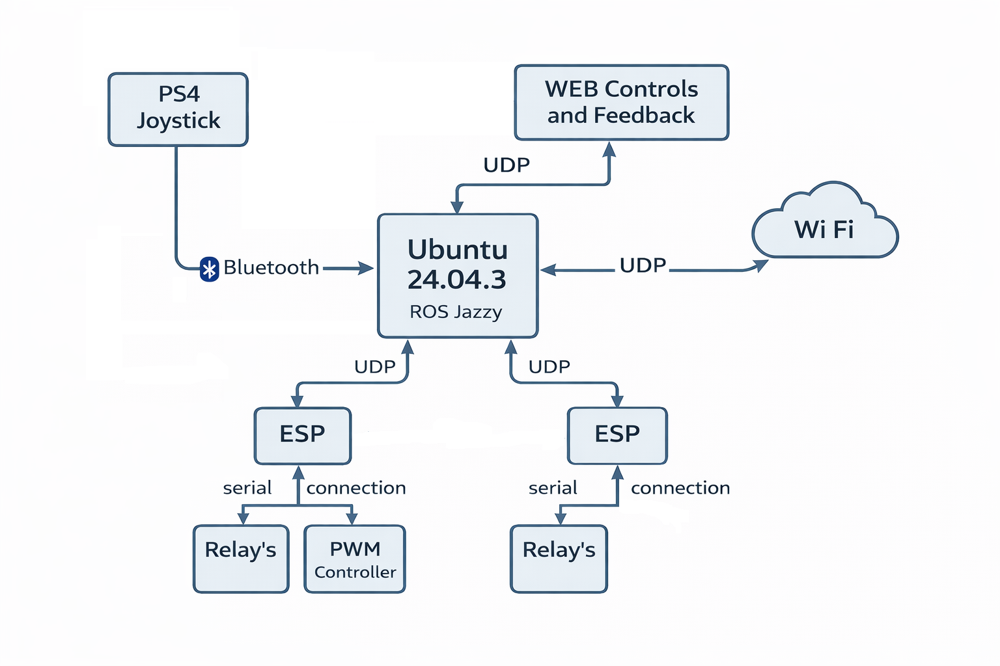

# TOMO ControlFactory – FSM Overview

Central **event-based state machine** for vehicle control (ESP output),
supporting **PS4 / Web / Auto** input sources and **Soft / Hard Emergency** modes.

---

## 1. Architecture (High Level)

- **PS4 / Web / Auto** send *pure events*
- **ControlFactory** is the *single source of truth*
- ESP never contains decision logic

---

## 2. FSM States

### 2.1 ARM STATE

| State | Description |
|------|-------------|
| DISARMED | Everything blocked, `engine_stop = 1` |
| ARMED | System active |

**Rules:**
- Entering `ARMED` → `front_position = ON`
- Leaving `ARMED` → hard reset of all outputs

---

### 2.2 POWER STATE

| State | Description |
|------|-------------|
| OFF | Drivetrain disabled |
| ON | Drivetrain enabled |

**Rules:**
- Entering `POWER ON`:
  - `clutch_active = 1`
  - `brake_active = 1`
- Leaving `POWER`:
  - `clutch_active = 0`
  - `brake_active = 0`
- `ENGINE_START` allowed **only** when `POWER ON`

---

### 2.3 LIGHT STATE (Permission Mode)

| State | Description |
|------|-------------|
| OFF | Lights cannot be changed |
| ON | Light configuration allowed |

**IMPORTANT:**  
Light state **does NOT represent the actual light status**, but:
> permission to modify light configuration

- Exiting light mode **does NOT reset lights**
- Light-related events are ignored while `LIGHT OFF`

---

## 3. Front Light FSM

OFF ──> SHORT ──> LONG ──> OFF

- Active only when `LIGHT ON`
- Implemented via `front_mode`:
  - `0 = OFF`
  - `1 = SHORT`
  - `2 = LONG`

---

## 4. Turn Signals (Blinkers)

### Normal Mode
- Left and right blinkers operate independently
- Blink period: **0.5 s**
- Active only when enabled

### Emergency Override

| Emergency | Blink Period | Blinkers |
|---------|--------------|----------|
| SOFT | 0.5 s | Both |
| HARD | 0.25 s | Both |

- Emergency **ignores light mode**
- Blinkers are forced regardless of user input

---

## 5. Emergency FSM

### SOFT EMERGENCY
- Blocks:
  - `ENGINE_START`
  - `MOVE_ALLOWED`
  - `CLUTCH`
  - `BRAKE`
- Saves full system state
- Activates hazard blinking (0.5 s)

### HARD EMERGENCY
- Full system reset
- Hazard blinking (0.25 s)
- Ignores all incoming events

### RELEASE
- Restores state **only** from SOFT emergency
- HARD emergency cannot be auto-released

---

## 6. Event Rules (Reducer)

| Category | Rule |
|--------|------|
| STATE | Changes FSM states |
| EVENT | Allowed only when not in emergency |
| LIGHT | Allowed only when `LIGHT ON` |
| SYSTEM | Highest priority |

---

## 7. Design Principles

- ControlFactory = **single source of truth**
- Nodes send **events**, not logic
- FSM > if-else chains
- Emergency has **highest priority**
- Light mode = permission, not reset

---

## 8. Status

**FINAL FSM – production ready** 🚜🔥
